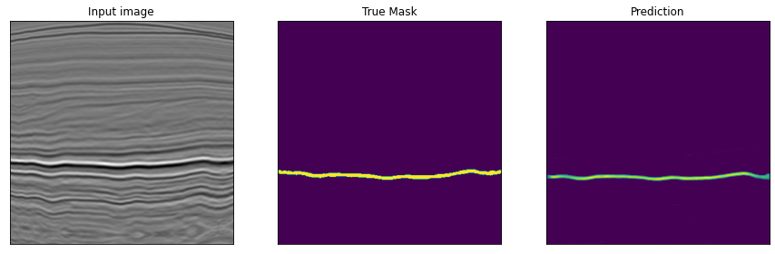
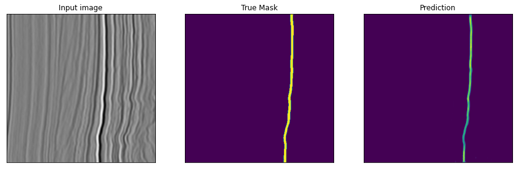
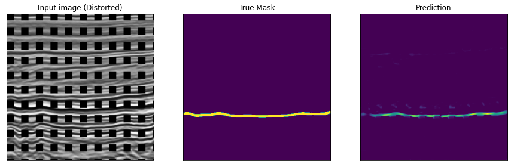

# General info

This project contains my code for the sediment segmentation challenge I took part in, during my exchange to ITMO University, St. Petersburg. The aim of the challenge is to build a machine learning model for image segmentation.

# Data
The data was provided as part of the challenge and is not made publicly available. The data is in form of sediment images of different shapes, with a segmentation mask of seven channels, which the model uses as a ground truth.

# Model
I implemented a full fledged UNet neural network with a custom loss function, which is an interpolation of the Dice-Loss and the Jaccard-Loss. In addition I added a pipeline for image transformations in order to obtain more robust results.

# Files
| File | Description |
| ---- | ----------- | 
| model| Notebook containing the model, as well as the training and evaluation process.|
| img/ | Contains the images used in the Readme. |

# Results
After training the model, the network was quickly able to predict the correct segmentation mask. This also worked for the transformed version of the images. Below you can find some example output:

# Resources
Here you can find some of the resources I used to develop my model:
- [UNet - Blog article](https://towardsdatascience.com/u-net-b229b32b4a71)
- [UNet - paper](https://arxiv.org/pdf/1505.04597.pdf)
- [Blog article on Batch Normalization order](https://www.reddit.com/r/MachineLearning/comments/67gonq/d_batch_normalization_before_or_after_relu/)
- [Dropout - paper](https://www.cs.toronto.edu/~hinton/absps/JMLRdropout.pdf)
